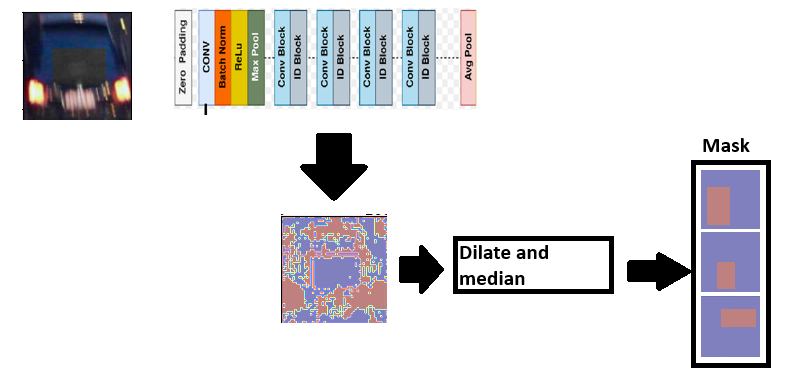
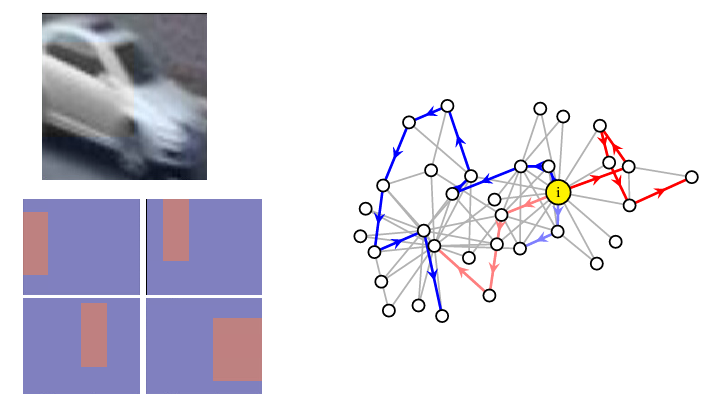
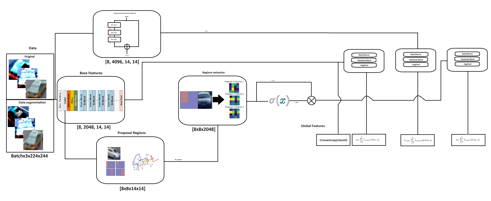
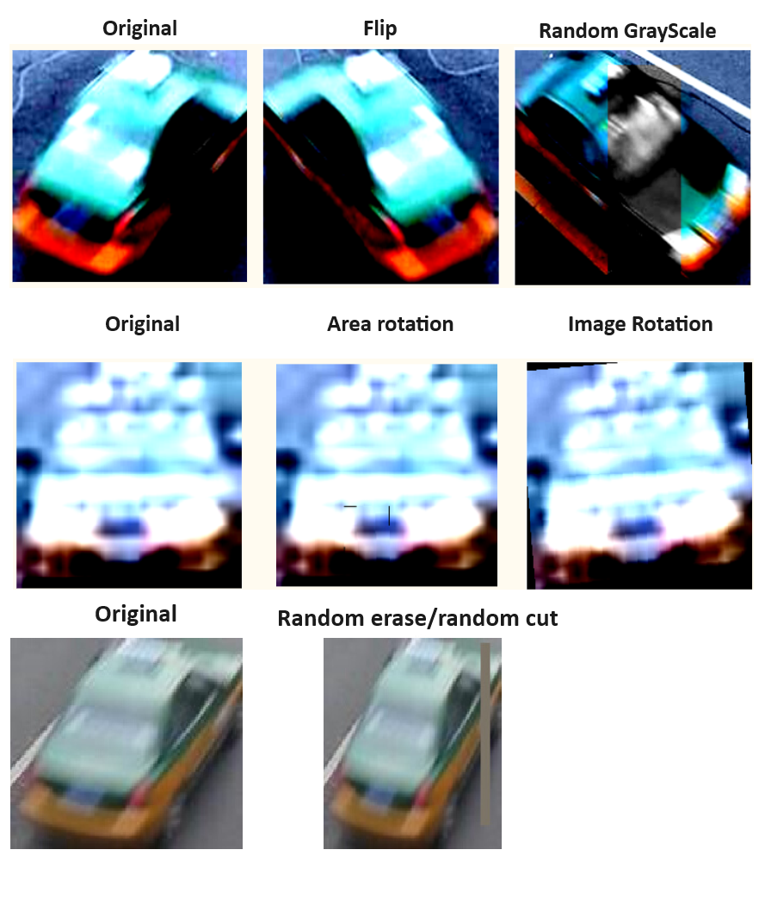

# Automatic-Region-proposal-for-cars-in-Re-id-models

Our approach proposes the use of a reduced region proposal module based on the same ResNet-based backbone and Montecarlo for stropes. This method suggests a approach using branches for both local and global attributes.


# Method

Our input will correspond to a classic re-identification approach using images and annotations, where the annotations follow the pattern: 0001_c1s1_000015_00.jpg, where 0001 is the instance ID, c1 is the camera ID, s1 is the sequence, and 000015 is the frame number.

Therefore, our model will receive images of instances with a certain level of context, considering that the VRIC dataset[Link to VRIC](https://qmul-vric.github.io/) anda VeRi [Link to VeRi](https://github.com/JDAI-CV/VeRidataset.) were used. This work mainly emphasized the use of the VRIC dataset, using a reduced version of it to explore the small dataset scenario. For cross inference, validation was performed using only small samples from other re-identification scenarios for vehicles.

Our approach, in terms of the model, explores a method based on the use of regions derived from stripes. The first method evaluates using a higher-level feature map, creating a binarization of that map, dilating it, and extracting the connected middle regions from this result.

Along the same lines, it proposes the use of QMC (Quasi-Monte Carlo). This method, uniformly and randomly, will propose stripes around areas with more information. For this, we suggest using histogram analysis, considering that with a larger portion of the image containing the instance, it can be distinguished by color values, shadows, and supported by thresholding, generating areas with values between 0 and 1. The size of the stripe will be between 10 to 15% of the reduced area size after thresholding. This histogram analysis operation to delimit the areas will be precomputed at the disk level.


## Dilated Region Proposal for cars (DRPC)



## Quasi-Monte Carlo for proposal regions (QMCPR)



# Proposed method




The proposed method is based on three branches. The first branch leverages prior knowledge from ImageNet to extract attributes using ResNet-50, with an adjustment focused on dimensionality to later fuse our feature maps.

The global attributes branch uses a customized extraction process:

ResNet-50 residual blocks, CONV2D 1x1, CONV2D, Global Average Pooling (GAP), Fully Connected (512 units) + ReLU, Dropout (0.5). The output of the base and proposed region branches is concatenated with this branch.

The local attributes branch uses a customized extraction process:

It delimits the most representative regions using one of the methods mentioned to generate stripes. We limit the input to these stripes and use the backbone ResNet feature extractor with the highest receptive field. Then, we compute a sigmoid function to reduce the feature map to relevant information, operating the features extracted with the backbone within the region delimited by the sigmoid function result. Finally, 1x1 convolutions or BatchNorm2d are applied.

# Environment Setup

To set up the environment, run the following command to install all necessary dependencies (CONDA):

```bash
conda create -n DRPC_REID python=3.9
conda activate DRPC_REID
pip install -r requirements.txt
```
# Prepare Dataset

Download the VRIC dataset and replace it with our vric_train.txt. (Link)

In the root directory, execute the following commands:

```bash
mkdir vehicle_data
cd vehicle_data
mkdir VRIC
mkdir mask
cd mask
mkdir VRIC
```
In the vehicle_data/VRIC folder, we need the train, query, and gallery images. You only need to replace the .txt files shared in this repository. The mask folder contains the original mask folder from VRIC.

Similarly, you need to replace the root folder and dataset folder in the /configs/softmax_triplet_vric.yml script.

If you're interested in using the VeRi dataset, we need to request it from the author's page:  VeRi [Link to VeRi](https://github.com/JDAI-CV/VeRidataset.) This dataset is under a non-commercial use license. 

# Data Augmentation

This work uses classical transformations based on the concept of instance and region of instance. Our transformations are applied to the entire image and parts of the image, adding variability to the data.



In the same approach, we study, train, and implement GANs to create artificial samples. We explore StyleGAN3 in the repo [Link to Stylegan](https://github.com/NVlabs/stylegan3). This experiment requires significant GPU memory, as this work explores this preprocessing context. We adopt classical augmentation for this reason

# Weigths


| Models      | Description                            | Link                                                                                                     |CMC K=5|CMC K=5 change context|
|-------------|----------------------------------------|----------------------------------------------------------------------------------------------------------|-------|----------------------|
| PGAN	       | All vric                               | [Link to Model](https://drive.google.com/file/d/1ZSJwGtm0avQab9Tb1QSYFnQHVVRjPU3d/view?usp=drive_link) |93.1   |56.9                  |
| PGAN	       | Small vric                             | [Link to Model](https://drive.google.com/file/d/1A2CsEjNyMPdZSBVXsgCoxSEkDu99boz9/view?usp=drive_link) |60.1   |                      |
| PGAN	       | All veRi                               | [Link to Model](https://drive.google.com/file/d/1XWMifTM4l1jNozStG9E42IfstWr4nqYi/view?usp=drive_link) |97.5   |                      |   
| Ours Refine 1| All vric                               | [Link to Model](https://drive.google.com/file/d/1z60rveZ6hOt0-8ISFajIw75DWkObHx9-/view?usp=drive_link) |89.8   |64.4                  |
| Ours Refine 1| Small vric                             | [Link to Model](https://drive.google.com/file/d/1KxNxQu18hcfrTA3i9uFxPzaklNYk4pNg/view?usp=drive_link) |74.9   |53.3                  |
| Ours Refine 2| Small vric                             | [Link to Model](https://drive.google.com/file/d/1UWjwzsfXdTiHOH6elFXf4-knDT07qZbY/view?usp=drive_link) |71.5   |50.9                  |
| Ours         | All veRi                               | [Link to Model](https://drive.google.com/file/d/1xje1VY5VDAo46VTCn0NhN81xsHWV13Hu/view?usp=drive_link) |97.2   |                      |

# Test
```bash
Run . /Run_exp1.sh 
```

# Qualitative Result


# References

https://github.com/zhangxinyu-xyz/PGAN-VehicleRe-ID?tab=readme-ov-file

https://github.com/michuanhaohao/reid-strong-baseline

